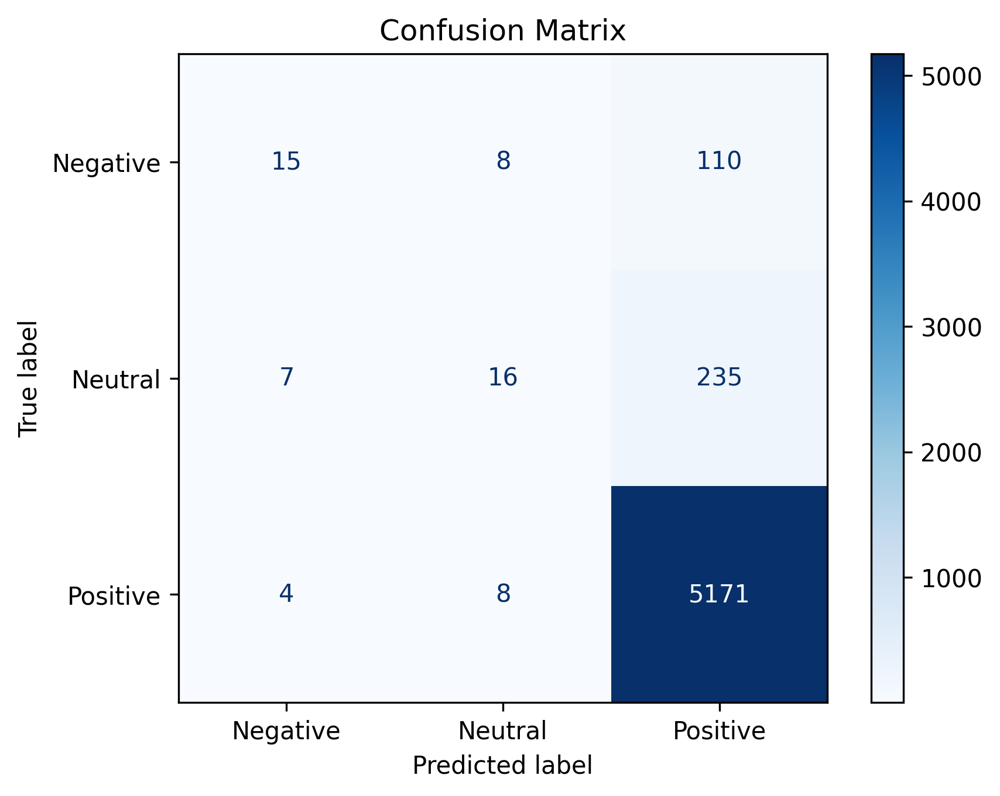
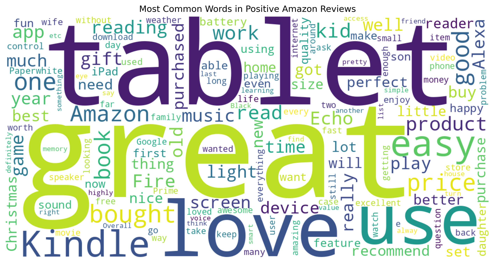
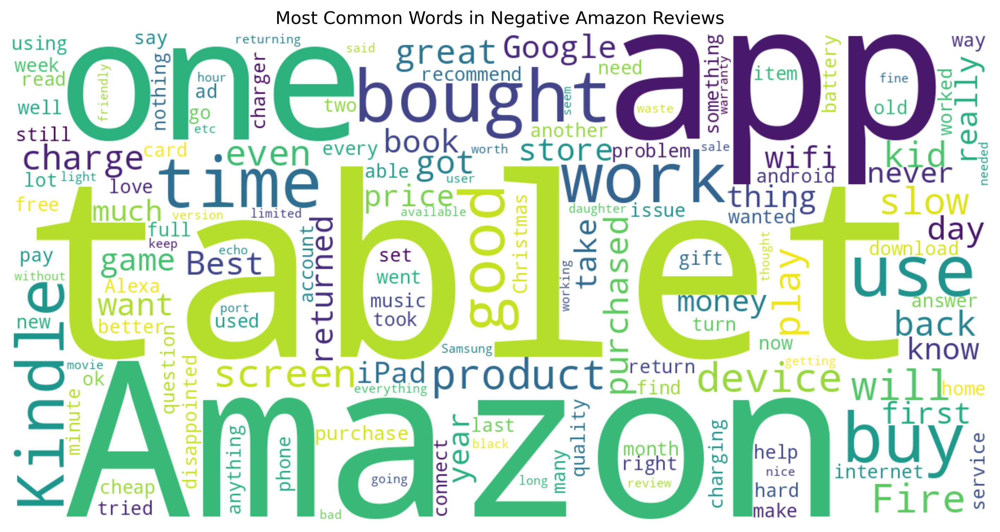

# Amazon Customer Review Intelligence

> An NLP and Machine Learning project that analyzes **34,000+ Amazon customer reviews** and predicts whether a review is **Positive, Neutral, or Negative**.

## Project Overview

This project demonstrates an end-to-end Natural Language Processing workflow using real-world Amazon customer reviews.

The model cleans review text, converts it into numerical features using **TF-IDF**, and classifies sentiment using **Logistic Regression**.

## Features

* 34,000+ real Amazon reviews
* Text preprocessing
* TF-IDF Vectorization
* Logistic Regression classifier
* Confusion Matrix
* Word Cloud visualization
* Custom review prediction

## Tech Stack

* Python
* Pandas
* NumPy
* Scikit-learn
* Matplotlib
* WordCloud
* Google Colab

## Workflow

1. Load dataset
2. Clean review text
3. Generate TF-IDF features
4. Train Logistic Regression
5. Evaluate model
6. Predict custom reviews

## Repository Structure

* `data/`
* `notebooks/`
* `src/`
* `outputs/`
* `models/`

## Sample Prediction

| Review            | Prediction |
| ----------------- | ---------- |
| Excellent quality | Positive   |
| Average product   | Neutral    |
| Waste of money    | Negative   |

## Results

### Confusion Matrix

### Positive Word Cloud

### Negative Word Cloud

## Future Improvements

* Streamlit web app
* BERT-based sentiment model
* Model deployment
* Dashboard with business insights
