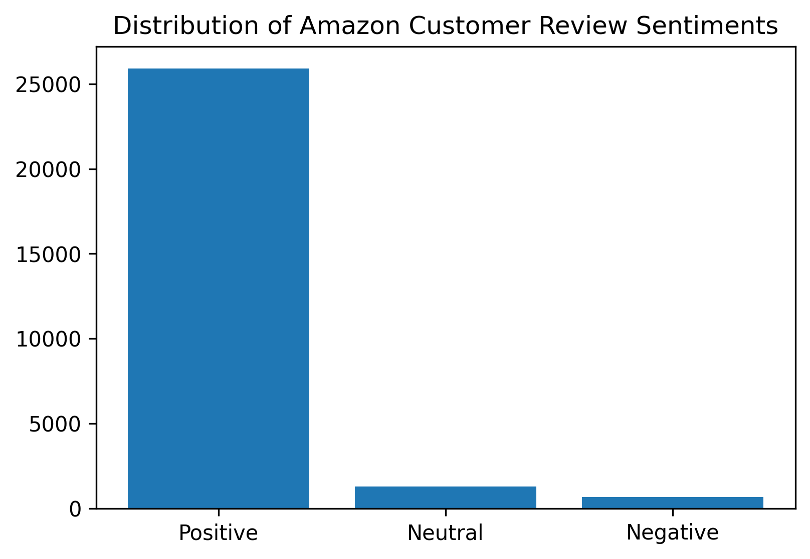
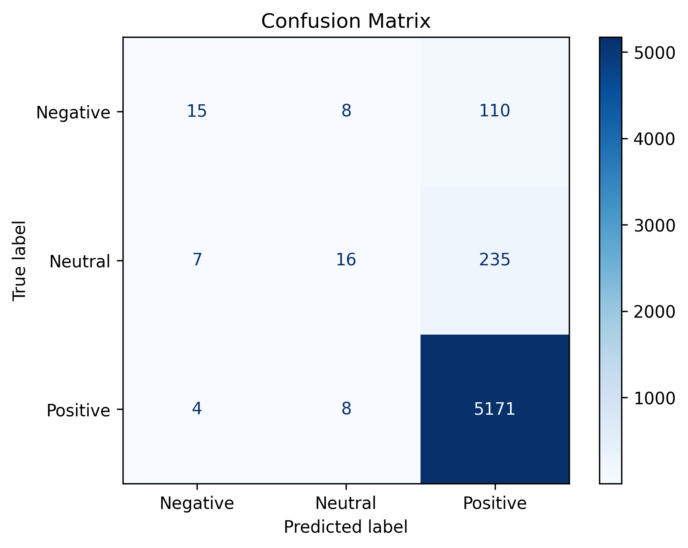
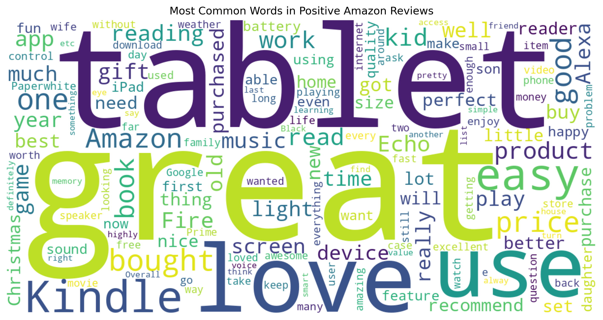
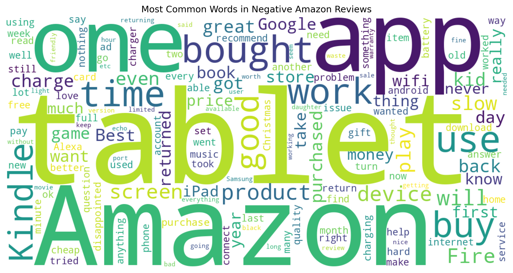

# Amazon Customer Review Intelligence

> Sentiment analysis of **27,867 Amazon product reviews** using TF-IDF and Logistic Regression. The model classifies each review as **Positive**, **Neutral**, or **Negative**.


<!-- Replace <REPO> below with your repository name to activate the badge -->
[](https://colab.research.google.com/github/akritik12/<REPO>/blob/main/notebooks/Amazon_sentiment_analysis.ipynb)

---

## Project Overview

Customer reviews contain useful signals about product quality, but reading thousands of them by hand is slow. This project builds an end-to-end NLP pipeline that:

1. Turns star ratings into sentiment labels
2. Converts review text into TF-IDF features
3. Trains a Logistic Regression classifier
4. Evaluates it with per-class metrics and a confusion matrix
5. Uses word clouds to find what customers praise and complain about

The project also looks honestly at a common real-world problem: **severe class imbalance**, and how it can make a high accuracy score misleading.

---

## Dataset

| Detail | Value |
| --- | --- |
| Source | [Consumer Reviews of Amazon Products (Datafiniti, Kaggle)](https://www.kaggle.com/datasets/datafiniti/consumer-reviews-of-amazon-products) |
| File | `1429_1.csv` |
| Raw size | 34,660 reviews × 21 columns |
| After cleaning | 27,867 reviews |
| Products | Amazon devices: Fire tablets, Kindle, Echo, Fire TV, and others |
| Columns used | `name`, `reviews.rating`, `reviews.text` |

### Sentiment labels

Labels come from the star rating:

| Rating | Sentiment | Count | Share |
| --- | --- | ---: | ---: |
| 4–5 ★ | Positive | 25,913 | 93.0% |
| 3 ★ | Neutral | 1,289 | 4.6% |
| 1–2 ★ | Negative | 665 | 2.4% |



---

## Workflow

```
Load CSV → Keep required columns → Drop missing rows → Label by rating
      → Stratified 80/20 split → TF-IDF (5,000 features, English stop words removed)
      → Logistic Regression → Evaluate → Word clouds → Save model
```

| Step | Details |
| --- | --- |
| Train/test split | 22,293 train / 5,574 test, stratified, `random_state=42` |
| Vectorizer | `TfidfVectorizer(stop_words="english", max_features=5000)` |
| Classifier | `LogisticRegression(max_iter=1000)` |

---

## Results

### Overall

| Metric | Score |
| --- | ---: |
| Accuracy | **93.33%** |
| Macro F1 | **0.42** |
| Weighted F1 | 0.91 |

### Per class

| Class | Precision | Recall | F1-score | Support |
| --- | ---: | ---: | ---: | ---: |
| Negative | 0.58 | 0.11 | 0.19 | 133 |
| Neutral | 0.50 | 0.06 | 0.11 | 258 |
| Positive | 0.94 | 1.00 | 0.97 | 5,183 |

### Confusion Matrix



### What the results mean

The 93.33% accuracy looks strong, but it is only slightly better than a model that **always predicts "Positive"**, which would score about 93.0% on this test set. The per-class numbers show the real picture:

* **Positive** reviews are recognized almost perfectly (recall 1.00).
* **Negative** reviews are mostly missed: only 15 of 133 were caught, and 110 were labeled Positive.
* **Neutral** reviews are mostly missed: only 16 of 258 were caught, and 235 were labeled Positive.

This happens because the model sees 39 positive reviews for every negative one during training, so predicting "Positive" is almost always the safest choice. **Macro F1 (0.42)** is a more honest measure of performance here than accuracy.

---

## Sample Predictions

These are the actual outputs from the notebook:

| Review | Expected | Predicted | |
| --- | --- | --- | :---: |
| "This tablet is amazing and works perfectly!" | Positive | Positive | ✅ |
| "The battery died after one day." | Negative | Positive | ❌ |
| "I want a refund." | Negative | Positive | ❌ |
| "It's okay, nothing special." | Neutral | Positive | ❌ |

These results confirm the bias toward the majority class described above.

---

## Key Insights

### Positive reviews



### Negative reviews



Common themes in 1–2 star reviews:

* **App and ecosystem limits:** "app", "Google", "store", and "download" appear often, suggesting frustration with app availability on Fire devices.
* **Performance:** "slow", "wifi", and "connect" point to speed and connectivity issues.
* **Charging and battery:** "charge", "charger", "charging", and "battery" come up repeatedly.
* **Returns and value:** "returned", "return", "money", "waste", and "disappointed" show buyers who felt the product wasn't worth it.

### Business takeaway

Almost all reviews are positive, so the few negative ones carry the most useful feedback. A useful sentiment model must be good at finding that small minority, which is why improving Negative recall is the top priority.

---

## Tech Stack

* Python
* Pandas
* Scikit-learn
* Matplotlib
* WordCloud
* Pickle
* Google Colab

---

## Repository Structure

```
├── data/          # Dataset (download 1429_1.csv from Kaggle and place it here)
├── notebooks/     # Amazon_sentiment_analysis.ipynb (full analysis)
├── src/           # Reusable scripts for preprocessing, training, and prediction
├── outputs/       # Charts: confusion matrix, word clouds, sentiment distribution
├── models/        # sentiment_model.pkl and tfidf_vectorizer.pkl
└── README.md
```

---

## How to Run

### Option 1: Google Colab (easiest)

1. Click the **Open in Colab** badge at the top.
2. Download `1429_1.csv` from [Kaggle](https://www.kaggle.com/datasets/datafiniti/consumer-reviews-of-amazon-products).
3. Run all cells and upload the CSV when prompted.

### Option 2: Run locally

```bash
git clone https://github.com/akritik12/<REPO>.git
cd <REPO>
pip install pandas scikit-learn matplotlib wordcloud jupyter
jupyter notebook notebooks/Amazon_sentiment_analysis.ipynb
```

When running locally, remove the `google.colab` upload cell and load the file directly:

```python
df = pd.read_csv("data/1429_1.csv", low_memory=False)
```

### Use the saved model

```python
import pickle

model = pickle.load(open("models/sentiment_model.pkl", "rb"))
vectorizer = pickle.load(open("models/tfidf_vectorizer.pkl", "rb"))

review = "Great tablet for the price!"
print(model.predict(vectorizer.transform([review]))[0])
```

---

## Limitations

* **Class imbalance:** 93% of the data is Positive, so the model rarely predicts Negative or Neutral.
* **Negation is lost:** scikit-learn's English stop-word list removes words like "not" and "no", so "not good" and "good" look similar to the model.
* **Single-word features:** without bigrams, phrases like "stopped working" or "waste of money" are split into separate words.
* **Labels come from ratings:** a 5-star rating with a critical review, or the reverse, adds noise to the labels.

---

## Future Improvements

* [ ] Handle class imbalance with `class_weight="balanced"` or oversampling, and compare macro F1
* [ ] Keep negation words and add bigrams (`ngram_range=(1, 2)`)
* [ ] Compare with Linear SVM and Naive Bayes
* [ ] Fine-tune a transformer model such as DistilBERT
* [ ] Build a Streamlit app for live predictions
* [ ] Create a dashboard of complaints grouped by product

---

## Author

**Akriti Kachroo**
Portfolio: [akritik12.github.io](https://akritik12.github.io/)
